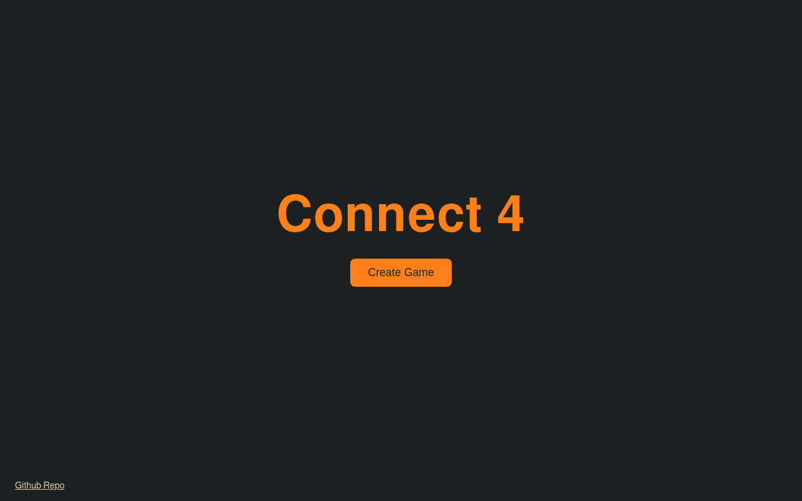

# Connect 4
A simple Multiplayer Connect 4. Create a Game/Room send link to another person and you can play together.

## Stack
│ | Layer    | Tech |                                                                 │
│ |----------|------|                                                                 │
│ | Frontend | Angular 22 (signals), SignalR client, SCSS |                           │
│ | Backend  | ASP.NET Core (.NET 10) minimal API, SignalR hub |                      │
│ | State    | In-memory room store (no database) |                                   │
│ | Infra    | Docker Compose, nginx, self-hosted behind Cloudflare Tunnel |          │
│ | CI/CD    | GitHub Actions — xUnit + Vitest on every push, deploy via self-hosted runner |

## Screenshots

### Gameplay

